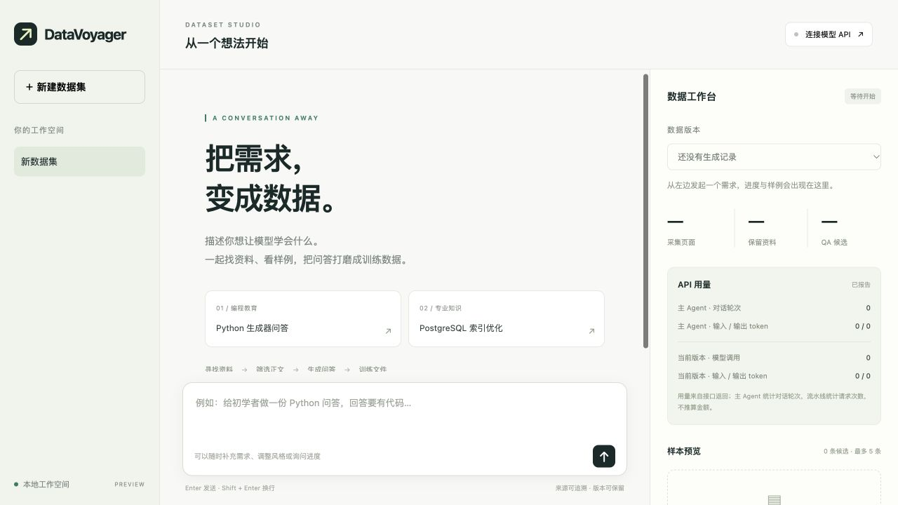

# DataVoyager

**Prepare domain training data from Hugging Face.**

The primary workflow is now the `domain-training-data` Codex Skill in
[`codex-skills/domain-training-data`](codex-skills/domain-training-data): Codex
searches the live Hugging Face catalog, reads dataset cards, inspects
configurations/splits and sample schemas, and lets the user choose sources in
the conversation. It then optionally downloads, merges, cleans, and converts
the approved sources into a training format with source provenance and an
audit report. Discovery and deterministic download do not need an LLM API key.

The local web workspace and QA generator remain an experimental legacy path;
they are not the orchestration layer for the Skill.

[中文](README_zh.md) · [Usage guide](docs/quickstart.md) · [Architecture](docs/architecture.md)



## Use it as a Codex Skill

Install the folder into your local Codex Skills directory (it is already
installed on this machine during the local setup):

```powershell
Copy-Item .\codex-skills\domain-training-data "$env:USERPROFILE\.codex\skills\domain-training-data" -Recurse
```

Then ask Codex, for example:

```text
Find English Hugging Face material for machine-learning fundamentals. Stop
after discovery and show each candidate's data card, license, config/split,
schema, and a recommendation. Do not download anything yet.
```

After choosing sources, continue in the same conversation with a target such
as “download 10,000 source rows”, “produce 10,000 retained deduplicated
records”, or “convert the approved English material into Chinese SFT QA while
retaining English technical terms in parentheses.” The distinction is
intentional: read rows, retained records, and valid QA pairs are different
quantities.

For datasets enabled in the HF Dataset Server, the bundled helper avoids the
optional `datasets` package and requires explicit config/split selection:

```powershell
python .\codex-skills\domain-training-data\scripts\hf_dataset.py inspect owner/dataset
python .\codex-skills\domain-training-data\scripts\hf_dataset.py rows owner/dataset --config CONFIG --split SPLIT --limit 3
```

See the [functional and quality acceptance cases](docs/skill-test-cases.md)
before relying on a new domain corpus.

## Legacy web workspace

```text
You: Make beginner QA about Python generators. Start with a small sample.
You: Focus more on common misconceptions, with fewer definition questions.
You: This version looks good. Let me download it.
```

The local chat workspace keeps the conversation, sample previews, source progress, usage, and dataset versions together. It is retained for experiments with the older all-in-one QA pipeline; source selection, configuration choice, and dataset preparation are better handled by the Skill above.

After installing the Python project below, build the chat controller with Node.js 22+ and Corepack:

```bash
cd codex-runner
corepack yarn install --immutable
corepack yarn build
cd ..
datavoyager chat
```

Open **http://127.0.0.1:8765**, enter your API endpoint, model, and key, and start chatting. The conversational controller uses **Codex SDK** and requires a Responses-compatible endpoint. See the [chat workspace guide](docs/chat.md).

## Or start from the command line

> Create a QA dataset about Python generators for beginners. Write answers in English and include short code examples. Prefer official Python documentation.

```bash
datavoyager build "Create a QA dataset about Python generators for beginners. Write answers in English and include short code examples. Prefer official Python documentation." \
  --output data/python-qa.jsonl
```

The output uses the Alpaca format. An illustrative row:

```json
{
  "instruction": "What happens when you call a Python generator function?",
  "input": "",
  "output": "It returns a generator iterator; the function body does not run yet. For example:\n\ndef numbers():\n    yield 1\n\ng = numbers()\nprint(next(g))  # Runs until yield and prints 1"
}
```

The same command can collect material for product-support questions, course exercises, or a specialist knowledge assistant. Change the topic, audience, and answer style in your request.

## Bring your API

Requires Python 3.10+ and a model endpoint that supports Chat Completions with JSON output.

```bash
git clone https://github.com/haolpku/DataVoyager.git
cd DataVoyager
python -m venv .venv
source .venv/bin/activate
pip install -e .

export DATAVOYAGER_BASE_URL="https://your-provider.example/v1"
export DATAVOYAGER_MODEL="your-model-name"
export DATAVOYAGER_API_KEY="your-api-key"
```

Run the request above. The default downloads up to 20 dataset rows; use `--max-source-rows` to change the sample limit. No separate browser, Node.js runtime, or DataFlow installation is needed for this workflow. Responses API endpoints are also supported via `DATAVOYAGER_API_FORMAT=responses`.

## Watch it work

```text
Request → Find sources → Merge & deduplicate → Clean & filter → (optional) Generate QA
```

The chat UI lets you choose whether a run stops after finding data, merging sources, cleaning evidence, or continues through QA generation. The terminal updates every two seconds with the current stage, downloaded source rows, accepted sources, QA candidates, model API calls, and reported input/output tokens.

Example progress display (illustrative numbers):

```text
[42s] generating QA | source rows 80 | accepted sources 5 | QA 3 | API calls 14 (0 failed, 1 active) | tokens 18200 in / 2100 out (partial; some usage unavailable or pending)
```

Check the latest snapshot from another terminal:

```bash
datavoyager status --run data/python-qa.jsonl.run
```

## Take the dataset with you

| File | Contents |
|---|---|
| `data/python-qa.jsonl` | QA pairs with `instruction`, `input`, and `output` fields |
| `data/python-qa.jsonl.sources.jsonl` | Source URL and metadata for each exported row |
| `data/python-qa.jsonl.run/report.json` | Final row count, elapsed time, and model API usage |

The pipeline selects topic evidence, generates QA with references, and makes a separate model-assisted source review. Only reviewed, deduplicated QA count toward the target; this is not expert certification. Generated answers still need review before training. Token counts come from provider responses; missing usage is flagged, and monetary cost is not inferred. See the [usage and quality notes](docs/quickstart.md#what-the-numbers-mean).

---

[Advanced acquisition & DataFlow pipelines](docs/runtime.md) · [Roadmap](docs/roadmap.md) · [Attribution & licensing](THIRD_PARTY_NOTICES.md)

Developer preview. A project-level license has not yet been assigned.

Intermediate datasets are independently downloadable, including after cancellation. You can also stop after raw collection or corpus preparation. See [stage datasets and evidence-based QA](docs/evidence-pipeline.md) for the new workflow and model-review limitations.
