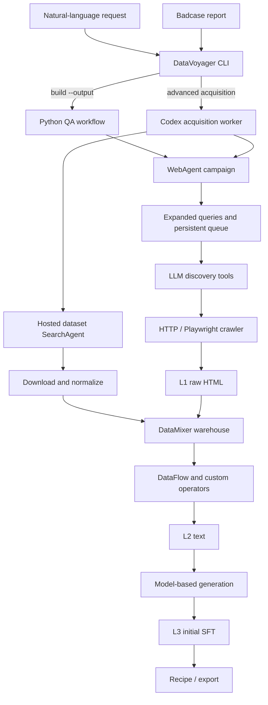

# Architecture

DataVoyager is an acquisition-and-curation layer. The import package remains
`dataflowwebagent`; DataMixer is an internal subsystem, not a separately installed dependency.

## Conversational workspace

`datavoyager chat` starts a loopback HTTP server with a bundled static frontend.
Each conversation stores a Codex thread ID. `codex-runner/src/chat.ts` starts or
resumes the SDK thread and returns a schema-constrained decision: reply, build,
or revise. Python validates the decision and launches a separate dataset process.
This is application-side action dispatch; the chat controller does not execute
shell commands to construct datasets. The existing advanced acquisition runner
is unchanged.

The controller receives recent messages and backend job snapshots, including
sample previews. Long-running dataset jobs continue independently, so a subsequent
chat turn can discuss progress. A single conversation can have one dataset job and
one agent turn active at a time. All mutations are serialized by the supervisor.

Every dataset version owns an isolated warehouse, output, and run directory.
A revision reads accepted L2 content through read-only SQLite and CAS access,
copies it into a new warehouse, then regenerates and validates QA. It preserves
old data and does not fetch new pages. A new collection is a standalone version.

Credentials live in server memory. Workers receive their own environment snapshot;
changing API settings cannot change a running worker's provider. Settings files omit
keys. The loopback server rejects foreign Host/Origin headers and requires a per-server
token for mutations. It is a local single-user app, not a multi-user hosted service.

## Control flow

With `build --output`, `voyager.py` calls `qa_pipeline.py`: one bounded web campaign
streams HTML through extraction, relevance filtering, QA generation, and structural
validation. The original request is passed into the QA prompt. Export produces
Alpaca JSONL plus a separate source manifest, with exact-pair deduplication.
`qa_progress.py` reads committed campaign and warehouse state and writes atomic
progress snapshots. Model requests are metered at the shared HTTP client boundary;
per-warehouse accounting includes worker/operator threads and retry attempts.

Without `--output`, `voyager.py` records the original request. `badcase_pipeline.py` initializes the
warehouse and starts acquisition. The outer worker reads its policy and invokes
CLI commands; its two-route acquisition plan is prompt-driven. The web campaign's
own queue, worker pool, and pipeline execution are implemented in Python.

The web kernel emits JSON actions for four tools: `search_web`, `open_page`,
`extract_related_urls`, and `submit_resource_urls`. It does not expose click/type
actions to the model. After resource submission, a bounded breadth-first crawl
collects HTML. The campaign can process it through a persistent streaming pipeline.

## Storage and artifacts

The warehouse contains `catalog.db`, content-addressed `blobs/`, model references,
campaign state, pipeline state, and `lineage/`. Acquisition runs contain the request,
status, prompts, logs, candidate manifests and, when successfully produced, final reports.
Model-managed warehouse entries persist environment references, not resolved keys.

L1/L2/L3 quality levels should not be confused with legacy comments describing
blob/catalog/index storage layers using the same labels.

## Extension points

- WebAgents implement the registry contract in `webagents/base.py`.
- Operators implement setup/process/teardown in `operators/base.py`.
- YAML pipelines combine native DataFlow operators, custom operators and LLM calls.
- Code and Text-to-SQL examples contain specialized validation paths. Generic QA's
  final validator checks dialogue structure; semantic verification is a separate milestone.

## Name and background

This repository is separate from the DataVoyager research prototype in
[Data-driven Discovery with Large Generative Models](https://arxiv.org/abs/2402.13610),
which studies hypothesis generation and analysis over existing datasets.
The imported implementation is credited in [third-party notices](../THIRD_PARTY_NOTICES.md).
